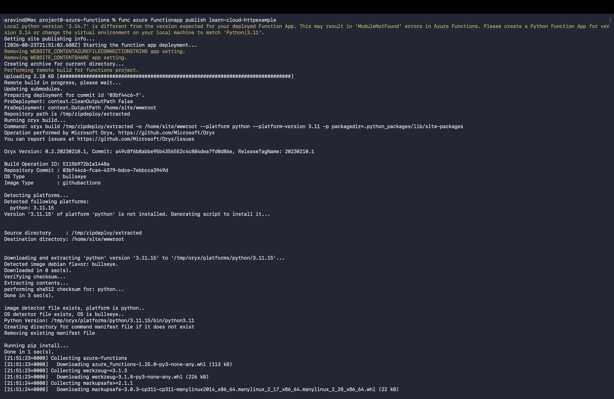
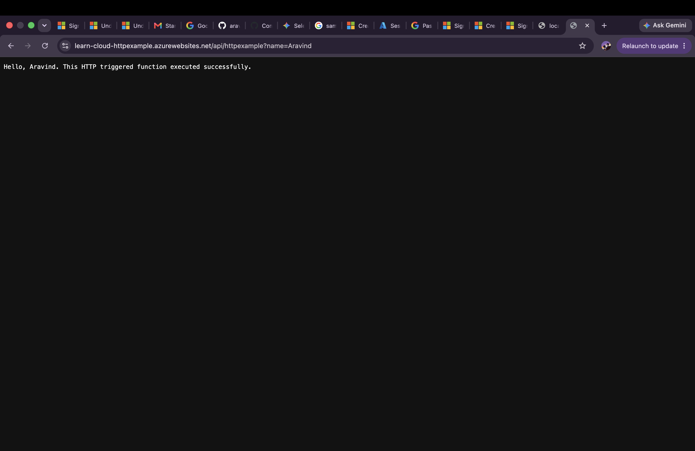

# Project 8: Serverless HTTP API with Azure Functions

## What this project does
Built a serverless HTTP-triggered API using Azure Functions and Python. Instead of running on a server that's always on, this function only executes (and only costs money) when someone actually sends a request to its URL.

## What I learned
- The difference between traditional "always-on" hosting and serverless (pay only when triggered)
- How to scaffold, run, and test an Azure Function locally before deploying (using Azure Functions Core Tools)
- How HTTP triggers work — code that runs in response to a web request
- Deploying Python code directly to Azure with `func azure functionapp publish`
- Azure resource providers need to be registered per subscription before first use (hit `MissingSubscriptionRegistration` for `Microsoft.Web`, fixed with `az provider register`)

## Tools used
- Azure CLI
- Azure Functions Core Tools
- Python 3.11
- Azure Functions (Consumption plan)

## How it works
1. `function_app.py` defines an HTTP-triggered function that returns a personalized greeting
2. Tested locally first with `func start` (http://localhost:7071)
3. Deployed to Azure with `func azure functionapp publish learn-cloud-httpexample`
4. Now live and publicly accessible at:
   `https://learn-cloud-httpexample.azurewebsites.net/api/httpexample?name=YourName`

## Proof it works
**Terminal deployment success:**

**Live API response in browser:**

## Cost note
Used Azure's Consumption plan (pay-per-execution, free tier friendly) plus a required Standard_LRS storage account. Resources torn down after testing to avoid ongoing charges.
